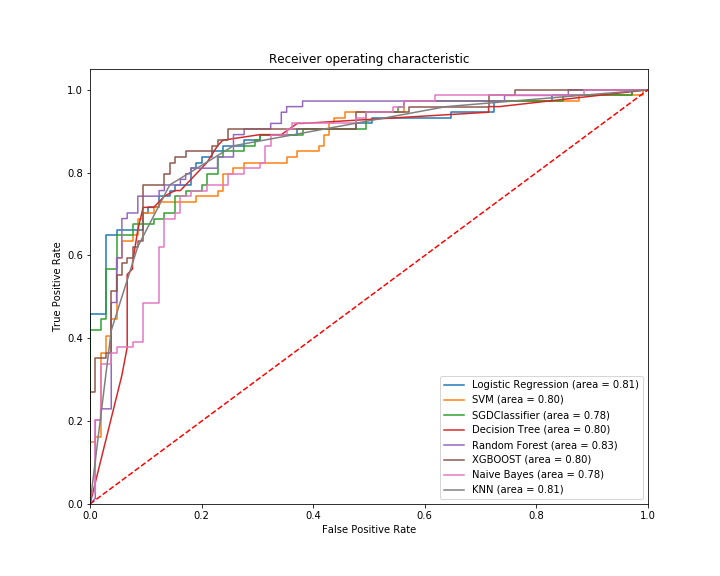

The sinking of the RMS Titanic is one of the most infamous shipwrecks in history.� On April 15, 1912, during her maiden voyage, the Titanic sank after colliding with an iceberg, killing 1502 out of 2224 passengers and crew. This sensational tragedy shocked the international community and led to better safety regulations for ships.
One of the reasons that the shipwreck led to such loss of life was that there were not enough lifeboats for the passengers and crew. Although there was some element of luck involved in surviving the sinking, some groups of people were more likely to survive than others, such as women, children, and the upper-class.
In this challenge, we ask you to complete the analysis of what sorts of people were likely to survive. In particular, we ask you to apply the tools of machine learning to predict which passengers survived the tragedy.

**_Data_**

**The data has been split into two groups:**
* training set (train.csv)
* test set (test.csv)

**[_Data Analysis Part_](https://github.com/NMShihab/Titanic/blob/master/Analysis.ipynb)**
* Data Visualization
* Data cleaning
* Data encoding(Categorical to Numerical)
* Create a new data sets [Mod_1_train](https://github.com/NMShihab/Titanic/blob/master/Mod_1_tran.csv),[Mod_1_test](https://github.com/NMShihab/Titanic/blob/master/Mod_1_test.csv)
* Feature Engineering
* Create a new data sets [Mod_2_train](https://github.com/NMShihab/Titanic/blob/master/Mod_2_tran.csv),[Mod_2_test](https://github.com/NMShihab/Titanic/blob/master/Mod_2_test.csv)

**Using Language**
* Python

**Using Library** 
* Numpy 
* Pandas 
* Matplotlib
* Seaborn
* Scikit-learn (sklearn)

**_Algorithm and their evalution_** 

**[For Mod_1 dataset](https://github.com/NMShihab/Titanic/blob/master/Machine_learning_models_mod_1_dataset.ipynb)**

|  NO  |   Algorithm Name   |   Type     | Highest accuracy | Precision for 0 | Precision for 1 | 
| :--- | :----------------- | :--------- | :--------------- | :-------------- | :-------------- | 
|  1   | Logistic Regresson | Classifier |      0.821       |     0.83        |      0.81       |
|  2   |       SVM          | Classifier |      0.815       |     0.82        |      0.82       |
|  3   |   SGDClassifier    | Classifier |      0.798       |     0.81        |      0.79       |
|  4   |   DecisionTree     | Classifier |      0.815       |     0.82        |      0.82       |
|  5   |   Random Forest    | Classifier |      0.843       |     0.83        |      0.86       |
|  6   |      XGBOOST       | Classifier |      0.832       |     0.84        |      0.81       |
|  7   |    Naive Bayes     | Classifier |      0.776       |     0.83        |      0.71       |
|  6   |      KNN           | Classifier |      0.821       |     0.84        |      0.79       |

## _Performance Measure graph_

**Accourding to this table and the graph  _Random Forest_ gives us better result**
